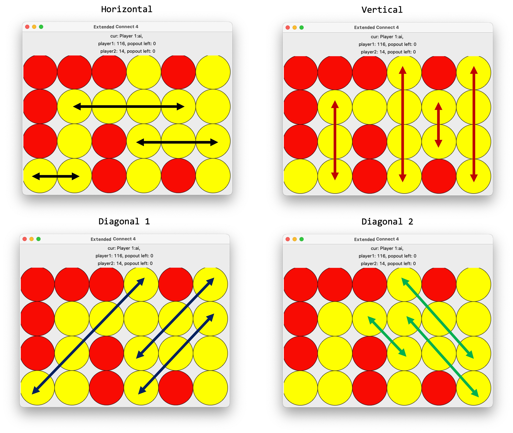

# Assignment II: Game Playing AI Agent

# Introduction

This assignment concerns implementing an AI agent for playing a two-player game, and is intended to give exposure to planning in the presence of an adversary with a budget on the computation allowed before performing a decision (move).  

# Problem Description

## Standard Connect4 Game

The standard Connect4 game is a two-player board game. There are two coloured sets of tokens.  Each player is assigned a colour. The traditional game is played on a board that is vertical 6x7 (6 rows and 7 columns). A player picks tokens for her/his assigned token and then takes turns for dropping tokens into a specific column in a grid. The pieces fall straight down in the column in which they are inserted and take up the lowest space in the column. The game ends when any one of the players creates one consecutive sequence of their four tokens along a row or along a column or along a diagonal. Some of you may have played this game earlier (see a short video below).

[classical_connect_4.mp4](README_files/classical_connect_4.mp4)

## ExtendedConnect4 Game

In this assignment, we consider an extension of the standard game (let's name it ExtendedConnect4). The rules and scoring described below. 

### Board Size

In ExtendedConnect4, we generalise the board size to (m, n) where the game board dimensions can vary. However, the number of columns (n) will always be even. As in the traditional game, there are two coloured sets of tokens. Each player is assigned a colour. 

### Moves

In ExtendedConnect4, there are standard moves as are there in the standard Connect4 with the additional inclusion of a PopOut Move. Further, there is a time budget for making a move. These are described next:

- **Standard Moves.** As in the the standard Connect4, each player can insert tokens of their own colour in any column on the board. The tokens drop in the target column and occupy a position at the base or on top of the highest token already present in that column.
- **PopOut Moves.** In ExtendedConnect4, a player is also allowed a *pop-out* move. Given a column, a *PopOut* move removes the bottom-most token and shifts all other tokens in that column by one position downwards. Further, player one can take an PopOut move on *even numbered columns* (0, 2, 4, …) and player two can only perform a PopOut move on the *odd numbered columns* (1, 3, 5, …).
- **Time Budget for a Move.** Each player is given a fixed time to return the next move (or action).

The animation below shows an example game progression. Here, Player 1 is using  the yellow coloured tokens and Player 2 is using with the red coloured tokens.

[Screen Record.mov](README_files/Screen_Record.mov)

### Game End

Unlike traditional Connect4, a game of ExtendedConnect4 does not stop upon completion of the first sequence of four consecutive tokens. Instead, the game continues till there is a stalemate is reached, i.e., there are no possible moves left for any player. 

Consider the following examples when the board is full of tokens (no possible standard move)

1. PopOuts left for Player1: 0, PopOuts left for Player2: 4
    1. next_turn: Player1 → Game ends.
    2. next_turn: Player2 → Can use one PopOut move.
2. PopOuts left for Player1: 4, PopOuts left for Player2: 0
    1. next_turn: Player1 → Can use one PopOut move.
    2. next_turn: Player2 → Game ends.
3. PopOuts left for Player1: 0, PopOuts left for Player2: 0
    1. next_turn: Player1 → Game ends.
    2. next_turn: Player2 → Game ends.

### Scoring

Scores are awarded when 2, 3, and 4 tokens, with the same colour, appear consecutively along a direction. The scores are computed along the horizontal, the vertical, and the two diagonal directions independently and added.  A player gets *2 points for every 2 consecutive tokens, 5 points for every 3 consecutive tokens, and 20 points for every 4 consecutive tokens.* As an example, consider the following board state given in Figure 1. For this board, player 1 with yellow tokens, has a score of 49 (see the table below).  

**



                                     **Figure 1:** Sample board state for ExtendedConnect4 Game.

| Consecutive tokens | Number | Points |
| --- | --- | --- |
| 2 consecutive tokens | 3 | 3 x 2 |
| 3 consecutive tokens | 6 | 6 x 5 |
| 4 consecutive tokens | 4 | 4 x 20 |
| Total score |  | 116 |

# Starter Code

Please setup a conda ****environment with the allowed dependencies for the assignment with the commands provided below. First time conda users can download and install [*Miniconda*](https://docs.conda.io/en/latest/miniconda.html).

### Conda Environment

```python
conda env create --file environment.yml # Create the conda environment
conda activate myenv # Run the environment
```

### Code Package

Please download the starter code from Moodle. The starter code is briefly described next. The downloaded package should yield the files listed below. Functions include comments and type information and are self-explanatory. 

```yaml
├── README.md
├── connect4
│   ├── ConnectFour.py
│   ├── __init__.py
│   ├── config.py
│   ├── initial_states
│   │   ├── case1.txt
│   │   ├── case2.txt
│   │   ├── case3.txt
│   │   └── case4.txt
│   ├── players
│   │   ├── __init__.py
│   │   ├── ai.py (Note: Please only modify this file!)
│   │   ├── human.py
│   │   └── random.py
│   ├── utils.py
│   └── utils_test.py
└── environment.yml
```

**Initial Game States.** The folder titled `initial_states` contains few game settings that you may use for testing. The first line contains the number of pop-out moves each player gets, and after that it gets a `m * n` board with values of 0, 1, and 2. 

**Utility Functions.** Please see `[utils.py](http://utils.py)` that can be used in your implementation.  

```python
def get_pts(player_number: int, board: np.array) -> int
"""Returns the total score of player (with player_number) on the board"""

def get_valid_actions(player_number: int, 
											state: Tuple[np.array, Dict[int, Integer]]) 
											-> List[Tuple[int, bool]]:
"""Will return all the valid actions for player (with player_number) for the 
	 provided current state of board"""

class Integer
"""Usecase mentioned in Your Code section"""
```

### Interaction with the Game Simulator

The following command will initiate a game of ExtendedConnect4 between **agent_1** and **agent_2** with the initial state given at the **test_case_path**. The script can be invoked with several options described subsequently. The command should display the GUI showing the game. This time available to make a move is controlled by parameter `time`. 

```python
python3 -m connect4.ConnectFour {agent_1} {agent_2} {test_case_path} --time {time_in_seconds_per_step}
```

The following command will allow a **human agent** to play against the **AI agent.** The human agent (you) can type in a move as *"1"* or *"1P"*, where “1” indicates the column number. The presence or absence of “p” after the column number indicates if the move is a *PopOut* or a regular move. 

```python
python3 -m connect4.ConnectFour ai human connect4/initial_states/case4.txt --time 20
```

A simple **random agent** is provided in the starter code. The random agent simply picks its moves uniformly at random among the available ones. A game between an AI agent and the random agent can be initiated as follows. 

```python
python3 -m connect4.ConnectFour ai random connect4/initial_states/case4.txt --time 20
```

You might also see your bot play against itself.

```python
python3 -m connect4.ConnectFour ai ai connect4/initial_states/case4.txt --time 20
```

Moves that violate constraints are considered **invalid moves**. If a player attempts to play an invalid move, the game simulator does not change the game state (i.e., the attempted move is skipped) and the turn switches to the next player. Examples of invalid moves: (i) using more than the permitted **K** PopOut moves (ii) performing a PopOut move in an invalid column (Player1 can perform PopOut only in the even columns and Player2 only in the odd columns) and (iii) exceeding the permitted time duration per move (parameter T) in deciding your action.  

# What to Implement?

Please implement an AI agent for playing this game as follows. Please implement an expectimax agent and an adversarial agent described as follows. Note that your agent needs to plan its move under a limited time budget implies. Hence, it may not be possible to explore the entire game tree at the beginning of the game. Hence, consider a cutoff (or a depth-limited) for the search. You may incorporate heuristic functions in your search procedure (define features and adjust corresponding weights). 

### Part A. Playing Against a Random Agent

Please implement an agent based on *expectimax* that can play against the random agent. A random agent is provided to you. Note that a reasonable implementation for your agent should perform much better than the random agent. 

### Part B. Playing Against an Adversarial Agent

Please implement an agent that can play against an adversary. You can begin with minimax search and alpha-beta pruning. Please experiment by playing as a human against your own implementation as well as playing two instances of your agent against each other. Improve your approach based on the insights gained and arrive at your best algorithm for this problem.  

### Note

Please rely only on search/adversarial-search methods (covered in class) or their extension/adaptation. In case of a doubt in this regard, you may contact the TA to clarify. 

# Coding Guidelines

- Your implementation will reside in the file named `ai.py`. Do not modify any other files. Only this file will be submitted. Only `ai.py` file has to be modified.
- Please see the class `class AIPlayer` in `ai.py`.
    - In part A of your implementation, you will be filling in the code for `def get_expectimax_move(self, state)`. This function will be used when your agent plays against the random agent.
    - In part B of your implementation, you will be filling in the code for `def get_intelligent_move(self, state)`. This function will be used when your agent plays against an adversarial agent (human or bot).
    - Your implementation can utilise whatever additional classes and functions you develop, but you must keep the `class AIPlayer` signature intact.
    - The game state has a type `Tuple[np.array, Dict[int, Integer]]`. First element of tuple represents the board (2D np.array) and the second part is a dictionary with mapping player number to number of player moves left. Please do not edit this signature.

```python
board, num_popout = state
num_popout[1].get_int() # gets the popout moves remaining for the 1st player
num_popout[1].decrement() # decrement the popout moves left for the 1st player
num_popout[1].increment() # increment the popout moves left for the 1st player
```

- Finally, note that `player_number` and `time` are part of the constructor for the `class AIPlayer`.

```python
class AIPlayer:
    def __init__(self, player_number: int, time: int):
			"""
      :param player_number: Current player number
      :param time: Time per move (seconds) (T)
      """
			...
```

- Please use **Python 3.7** for your implementation. Your code should use only standard python libraries. Please do not include any dependencies on third party libraries or existing implementations of algorithms. A conda ****setup is already provided with the allowed dependencies for this assignment.
- The use of global variables and threading libraries is not permitted.

# Evaluation

The evaluation setup is described in the table below. 

| Board Layouts | Evaluation may be on different board layouts. Expect a maximum grid size of 12x12. |
| --- | --- |
| Number of valid actions | The maximum number of valid actions (standard moves + PopOut moves) will be 15. |
| Time duration per move (parameter T) | T can take a minimum value of 5 seconds and maximum value of 20 seconds. |
| Final scores for a game | The final credit at the end of the game will be computed as the difference between the your agent’s score and the other agent’s score.  |
| Which player moves first? | For each run, we will firstly run your agent as the first player and then as the second player then average out the scores (ameliorating any bias arising from which player starts first). Score refers to the difference between your score and the score of the opposing player.  |
| Max. number of PopOut moves | The parameter K can be at max 10. |

The evaluation format is as follows.

- The expectimax agent in your submission will be evaluated against the random agent. Points will be awarded based on percentage margin of the score of your implementation w.r.t. random agent upto 50%. NOTE: For evaluation of expectimax agent against random agent the board size will be (m,n) where 8≤m≤12, 10≤n≤12.
- The performance of the adversarial agent in your submission will be assessed in two parts. The first assessment will be based on final scores attained playing with a baseline agent (TA implementation). The second assessment will be organised in a tournament-mode where different submissions will have an opportunity to play with each other. This mode will involve stages where high-performing submissions will be promoted to the next stage.

# Submission Instructions

- Please submit your single best implementation in **`ai.py`**. Please describe the core ideas of your algorithm in the text file called **`report.txt`** (max. 2 pages in standard 11 point Arial font). The first line of the report should list the name and entry number of student(s) who submit the assignment.
